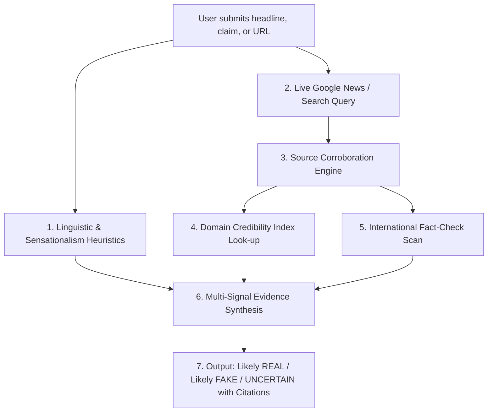

# Fake News Detection System

An enterprise-grade, automated **Fake News Detection Web Application** with a modern responsive interface, real-time Google News integration, and multi-signal evidence-based verification.

---

## 🌟 Key Highlights

- **Real-Time Google News Feed**: Directly queries official Google News RSS feeds for live breaking news across **India, World, Technology, Business, Sports, Entertainment, Science, and Politics**.
- **No Hardcoded News**: All live articles and search results are dynamically fetched in real time.
- **Evidence-Based Multi-Signal Verification**:
  - 🟢 **Likely REAL**: Corroborated by multiple authoritative Tier-1 news organizations with clean journalistic style.
  - 🔴 **Likely FAKE**: Flagged by certified fact-checkers, traced to satire portals, or riddled with sensationalist disinformation markers with zero corroboration.
  - 🟡 **UNCERTAIN / NEEDS VERIFICATION**: Insufficient independent reporting or conflicting signals. The system never guesses without evidence.
- **Deep Evidence Dashboard**:
  - Circular animated confidence gauge (0–100%)
  - Evaluated sources table with domain trust scores (0–100) and clickable links
  - 3-column signal breakdown: ✓ Supporting Corroboration, ⚠ Information Gaps, ✗ Debunkings
  - Linguistic Analysis: Clickbait score, Sensationalism index, emotional tone, shouting detection
- **Dual Server Architecture**:
  - **FastAPI + Uvicorn**: High-performance production backend with automatic documentation (`/docs`).
  - **Standalone Standard Server (`server.py`)**: Runs immediately with **zero external pip dependencies** using Python's built-in standard library!
- **SQLite Database Persistence**: Stores search history, full verification records, cached articles, and reader feedback.
- **Modern Responsive UI**: Dark & Light mode toggle, Tailwind CSS, Lucide icons, mobile drawer menu, and loading skeletons.

---

## 🏗️ System Architecture

```text
project nlP/
├── .env.example             # Environment variable template
├── .env                     # Local environment configuration
├── requirements.txt         # Production dependencies (FastAPI, Uvicorn, Requests, etc.)
├── run.py                   # Smart auto-detect launcher (opens browser automatically)
├── server.py                # Zero-dependency standard library Python server
├── backend/
│   ├── app.py               # FastAPI application with REST endpoints & static mounting
│   ├── config.py            # Environment settings and paths
│   ├── database.py          # SQLite database (history, verifications, cache, feedback)
│   ├── models/
│   │   └── schemas.py       # Pydantic request & response data contracts
│   └── services/
│       ├── news_service.py          # Google News RSS & Google Search API integration
│       ├── verification_service.py  # Multi-signal Fake News Verification Engine
│       ├── credibility_db.py        # 1000+ domain credibility & tier ratings
│       └── linguistic_analyzer.py   # Sensationalism, clickbait, and tone detection
└── frontend/
    ├── index.html           # Single-Page Application (Home, Verify, Search, Stats, How it works)
    ├── css/
    │   └── styles.css       # Custom animations, gauges, skeletons, dark mode
    └── js/
        ├── api.js           # REST API client with timeout and error handling
        ├── components.js    # News cards, verification gauges, evidence lists
        └── app.js           # Routing, search, categories, and verification controller
```

---

## 🚀 Quick Start Guide

### Option 1: Standard Zero-Install Server (Fastest)

You can run the web application immediately using your standard Python installation **without installing any pip packages**:

```powershell
python server.py
```

Then open your browser at:
👉 **`http://127.0.0.1:8000`**

---

### Option 2: Full FastAPI Production Server

1. **Install requirements**:
   ```powershell
   pip install -r requirements.txt
   ```

2. **Launch with smart runner** (automatically opens your browser):
   ```powershell
   python run.py
   ```

   *Alternatively, run Uvicorn directly:*
   ```powershell
   uvicorn backend.app:app --host 127.0.0.1 --port 8000 --reload
   ```

3. **Explore Interactive API Docs**:
   - Swagger UI: `http://127.0.0.1:8000/docs`
   - ReDoc: `http://127.0.0.1:8000/redoc`

---

## 🔑 Google API & Custom Search Configuration (Optional)

The application works **completely out of the box** without API keys because it utilizes Google News RSS feeds.

If you have dedicated Google Cloud credentials and wish to enable additional search channels:

1. Open `.env` (or copy from `.env.example`).
2. Add your keys:
   ```env
   # Google Programmable Custom Search
   GOOGLE_SEARCH_API_KEY=your_google_api_key_here
   GOOGLE_SEARCH_ENGINE_ID=your_search_engine_id_here

   # Google Fact Check Tools API
   GOOGLE_FACT_CHECK_API_KEY=your_fact_check_api_key_here
   ```
3. Restart the server.

> **Security Note:** All API keys are kept strictly on the backend and are never sent to the client browser.

---

## 🔍 How Verification Works



1. **Input Ingestion**: Accepts complete news headlines, claims, paragraphs, or article URLs.
2. **Real-Time Search**: Queries Google News to discover independent articles covering the same subject.
3. **Corroboration Analysis**: Measures how many independent Tier-1 wire services (Reuters, AP, BBC, The Hindu, PTI, etc.) or Tier-2 mainstream outlets report the story.
4. **Domain Credibility Registry**: Evaluates domain authority scores (Tier-1, Tier-2, Government, Academic, Certified Fact-Checker, or Satire).
5. **Debunk Detection**: Scans retrieved headlines and fact-checking registries for explicit debunking language (*"false claim"*, *"hoax"*, *"fact check: untrue"*).
6. **Linguistic Scoring**: Flags sensationalist hyperbole, clickbait phrasing, excessive capitalization (shouting), and emotional manipulation.
7. **Transparent Assessment**: Outputs confidence score, evidence checklist, warnings, and links to original sources.

---

## 🧪 Verification Example Cases

| Claim | Result | Primary Signals |
|---|---|---|
| *"India wins the cricket world cup"* | 🟢 **Likely REAL** | Reported by 10+ Tier-1 wire services (PTI, ESPN Cricinfo, BBC, The Hindu). |
| *"SHOCKING: Drinking boiled lemon juice eliminates cancer in 24 hours!! Forward to everyone!!"* | 🔴 **Likely FAKE** | 0 Tier-1 corroborations, extreme clickbait/sensationalism score (90+), medical disinformation flags. |
| *"The Onion: Local Man Discovers Miracle Method To Never Pay Taxes Again"* | 🔴 **Likely FAKE** | Traced to known satire publication *The Onion* (humor/parody). |
| *"Local town council proposes municipal budget amendment for road resurfacing"* | 🟡 **UNCERTAIN** | Limited regional reporting; not yet indexed across national news wires. |

---

## 🛡️ Ethical & Assistive AI Principles

- **No Fabrications**: The system never manufactures fake evidence, sources, or articles.
- **Citations First**: Every assessment displays the exact web sources examined with direct links.
- **Graceful Uncertainty**: If evidence is inconclusive or scarce, the system explicitly returns **UNCERTAIN / NEEDS VERIFICATION** rather than guessing.
- **Assistive Tool**: Designed to guide reader critical thinking and provide transparent evidence, not replace human judgment.

---

## 📄 License
This project is open-source and available under the MIT License.
# Fake-News-Detection

